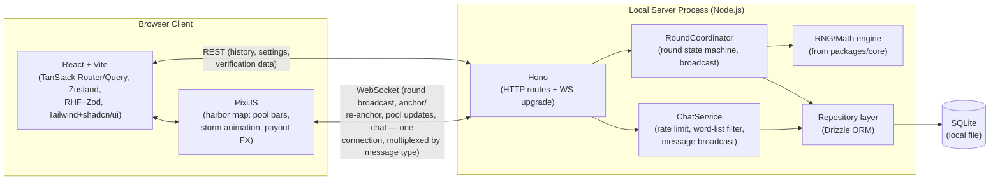
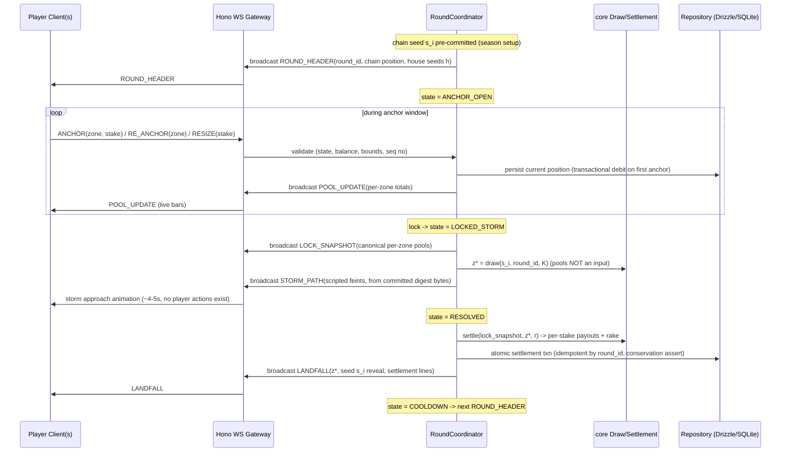

# Software Architecture

**Prepared by:** Software Architect, with input from Backend/Frontend/Database Engineers
**Phase:** 5 — Architecture
**Depends on:** [rng-provably-fair-spec.md](rng-provably-fair-spec.md),
[game-design-document.md](../02-game-design/game-design-document.md)
**Revision note:** the game changed from a Crash mechanic to Landfall (pari-mutuel survivor —
see [chosen-mechanic-rationale.md](../02-game-design/chosen-mechanic-rationale.md)). The stack,
package boundaries, and migration path below survive that pivot **unchanged** — which is
itself validation of the module design: the mechanic swap touches `RoundCoordinator`'s state
machine, the settlement logic in `core`, and the canvas scene, exactly the seams the
architecture drew. Sections §1 and §3 are updated for the new round flow; everything else
carries over with only terminology changes.

---

## 1. System Overview



`ChatService` is a sibling of `RoundCoordinator`, not a subordinate of it — chat is ambient and
continues across all round states ([game-design-document.md](../02-game-design/game-design-document.md)§5.1
keeps Harbor Chat active through anchoring, the storm, and cooldown), whereas `RoundCoordinator`
only cares about round-scoped messages. Both share the same WebSocket connection per client (one
socket, message-type-tagged payloads: `ROUND_*`/`POOL_UPDATE` vs. `CHAT_*`) rather than opening
a second connection, to keep client connection management simple and to keep the migration path
in §4 uniform — there is exactly one `RealtimeTransport` to migrate, not two.

## 2. Module Boundaries

| Package | Responsibility | Depends on | Must NOT contain |
|---|---|---|---|
| `packages/core` | Game rules, zone-draw derivation, pari-mutuel settlement math, Zod validation schemas, shared TS types/interfaces for API payloads, client-side fairness-verification logic (chain check, draw recompute, payout arithmetic) | nothing else in the monorepo | Any DOM API (`window`, `document`), any Node-only API (`fs`, `crypto` Node module directly — wrap behind an injected interface instead) — this package must be importable unmodified by `web`, `server`, and the future `mobile` package |
| `packages/web` | React app shell, PixiJS canvas integration, all UI/UX | `core` | Game-outcome logic — the client never computes or decides the struck zone or payouts authoritatively, only renders server state and sends anchor/stake *requests* (it may *re-verify* outcomes via core's verification functions — verification is read-only recomputation, not authority) |
| `packages/server` | Hono routes, WS round coordinator, `ChatService` (rate limiting, word-list filtering, message persistence/broadcast), Drizzle schema + repository implementations, session/auth (future) | `core` | UI code, browser-only assumptions |
| `packages/mobile` (future, not created this iteration) | React Native/Expo app | `core` | Duplicated game logic — must reuse `core` exactly as `web` does |

This boundary is what makes the "SQLite-now/D1-later" and "shared logic for future mobile"
requirements concrete rather than aspirational: `core` has zero environment-specific
dependencies by construction, so it is the one package guaranteed to survive every future
migration unchanged.

## 3. Round Lifecycle Sequence



Critical invariants, enforced entirely server-side: anchor/re-anchor/resize messages are
accepted only in `ANCHOR_OPEN`, against the server's clock
([security-review.md](../05-security/security-review.md)§1.2); the draw function takes no pool
or participant input ([security-review.md](../05-security/security-review.md)§1.9); settlement
is one idempotent atomic transaction with a runtime conservation assert
([security-review.md](../05-security/security-review.md)§1.20). There are **no player actions
after lock** — the entire mid-round message surface of the Crash design is gone
([security-review.md](../05-security/security-review.md)§1.3).

`CHAT_MESSAGE` frames (not shown, to keep the diagram legible) flow on the same connection in
any round state — `ChatService` validates length/rate/content and broadcasts, fully decoupled
from `RoundCoordinator`. Chat threats:
[security-review.md](../05-security/security-review.md)§1.13-1.15.

## 4. Local → Cloudflare Migration Path

The architecture is designed so each migration step below changes **one interface's
implementation**, not the code that calls it.

| Step | What runs | What changes from the previous step |
|---|---|---|
| 1. Localhost (this project's target) | Node.js + Hono via `@hono/node-server`, `ws` package for WebSocket, SQLite via `better-sqlite3` + Drizzle, Docker Compose for orchestration | — (baseline) |
| 2. GitHub | Same code, version-controlled, no runtime change | Nothing runtime — packaging/CI only |
| 3. Cloudflare Pages | `packages/web` static build deployed | Frontend build output target only; `web` package is already environment-agnostic since it talks to `server` over documented REST/WS contracts, not direct DB access |
| 4. Cloudflare Workers | `packages/server`'s Hono app deployed via `wrangler`, same route definitions, swap `@hono/node-server` adapter for the Workers fetch handler | Only the Hono *adapter* changes (a few lines); route/handler code is Hono-runtime-agnostic by design — this is the entire reason Hono was chosen over Express/Fastify |
| 5. Cloudflare D1 | Drizzle's SQLite dialect swapped for Drizzle's D1 dialect; repository interface (`packages/server/repositories`) implementation swapped, its consuming code (RoundCoordinator, route handlers) unchanged because they depend on the repository *interface*, not the driver | Only the repository implementation + Drizzle config change |
| 6. Durable Objects | `RoundCoordinator`'s in-memory-process implementation swapped for a Durable-Object-backed implementation behind the same `RoundCoordinator` interface; WebSocket handling moves to the DO's native WebSocket support (which Cloudflare Workers/DO support directly) | Only the coordinator's hosting/concurrency-primitive changes; round-lifecycle logic (the state machine in §3) is unchanged because it's expressed against the interface, not the hosting mechanism |

This table is the direct payoff of the module-boundary and interface-abstraction decisions above
— every step is additive/substitutive, never a rewrite of game logic, RNG, or validation.

## 5. Shared-Core Strategy for Future Mobile

`packages/core` (game rules, RNG verification, math engine, Zod schemas, TS types) is written
with zero DOM/Node-specific dependencies specifically so it can be imported unmodified into a
future React Native/Expo app (see mobile stack decision in
[technical-specification.md](../06-spec/technical-specification.md)). Only the rendering layer
(PixiJS/React DOM on web vs. React Native views/Skia on mobile) and the platform-specific
networking glue (fetch/WebSocket client wiring) are duplicated per platform — everything that
determines game *behavior* is shared.

## 6. Target Folder Structure

```
iGaming/
├── docs/                 # Phases 1-8 deliverables (this iteration)
├── packages/
│   ├── core/              # shared game logic, RNG verification, math/RTP, Zod schemas, TS types
│   ├── web/                # React + Vite + PixiJS app (depends on core)
│   ├── server/              # Hono + Drizzle + WS round coordinator (depends on core)
│   └── mobile/               # React Native/Expo (future iteration; placeholder only)
├── docker/                # Dockerfile(s) + compose config for local dev
├── pnpm-workspace.yaml
├── package.json
├── tsconfig.base.json
└── README.md              # Phase 9+, not created this iteration
```

**Not created in this iteration** — this structure is documented here as the target for Phase 9
(scaffolding), which is explicitly out of scope for the current docs-only pass.

## 7. Why Plain pnpm Workspaces (Not Nx/TurboRepo)

At the current/target package count (`core`, `web`, `server`, later `mobile` — four packages),
pnpm's native workspace filtering (`pnpm --filter`) is sufficient for running builds/tests across
packages. Nx and TurboRepo exist to solve build-graph caching and task-orchestration pain at a
scale (many packages, slow CI, complex interdependencies) this project does not have yet.
Adopting either now would be exactly the kind of premature complexity the master brief warns
against. This decision should be revisited only if/when CI build times or cross-package task
orchestration become a measured, real pain point after scaffolding — not preemptively.
