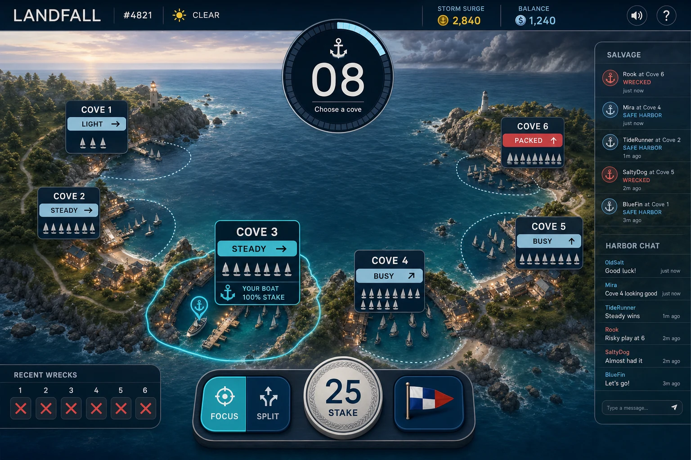
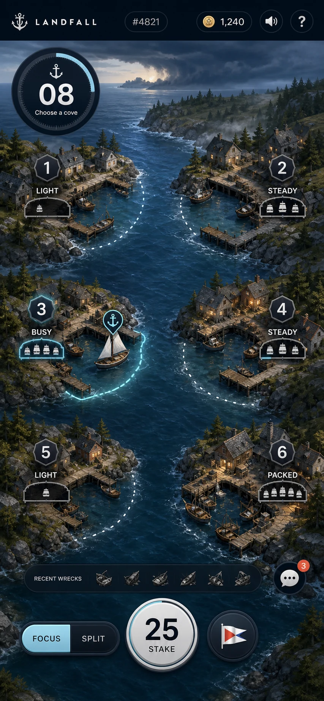

# LANDFALL UX/UI/Art/Audio Redesign v2 — "One Bay, One Storm"

**Prepared by:** Game UX Director / Product Design / Art Direction / Motion / Audio Direction
**Purpose:** Complete redesign of the presentation layer — UX, UI, visual language, assets,
motion, audio, and player communication — while keeping gameplay, math, economy, and the
round loop byte-for-byte identical.
**Depends on:** [category-redesign-v2.md](../02-game-design/category-redesign-v2.md) (mechanics,
frozen), [wireframes-and-user-flow.md](wireframes-and-user-flow.md) (v1 layout, superseded by
this document), [audio-design.md](../08-audio/audio-design.md) (current engine, re-directed
here), current client code (`packages/web/src`).
**Status:** Implemented reference design and continuing acceptance standard. Nothing in this
document changes a server message, a payout, a probability, or a phase duration.

**The one-sentence brief:** a 60-year-old who has never gambled, never gamed, and doesn't read
English must understand LANDFALL by watching one round — because the round *is* the tutorial.

---

## 0. Mandate, Non-Goals, and Deliverable Map

Untouched by this redesign: six harbors, one struck harbor, pari-mutuel settlement, Tide
Reports, Blind Fog, Final Order, Focus/Split, signals, Storm Power/Surge, provably fair RNG,
20-second rounds, every wire message in `packages/core/src/messages.ts`.

Redesigned: everything the player sees, hears, and touches.

| Brief deliverable | Section |
|---|---|
| 1 UX redesign · 2 UI redesign | §2–§6 |
| 3 Art direction · 5 Palette · 6 Typography · 7 Icons · 8/23 Assets | §7 |
| 4 Visual hierarchy | §3 |
| 9 Animation system · 10 Motion language · Microinteractions | §8 |
| 11 Audio · 12 Music · 13 SFX | §9 |
| 14 Accessibility | §10 |
| 15 Onboarding · 16 Tutorial | §6 |
| 17 HUD · 18 Screen-by-screen · 24 Wireframes · 25 Hi-fi descriptions | §5 |
| 19 Journey map | §4 |
| 20 Cognitive load analysis · 21 Pain points · 22 Solutions | §1 |
| 26 Mobile-first · 27 Desktop | §5.6–§5.7 |
| 28 Psychological reasoning | woven into every section + §11 summary |

## 1. Diagnosis — UX Pain Points and Cognitive Load (current build)

Audited against the running client (`HarborMapScene.ts`, `StakeBar.tsx`, `TopBar.tsx`,
`index.css`). Each pain point below fails the grandmother test in a specific way.

### 1.1 Pain points

| # | Pain point | Evidence in code | Why it fails a novice |
|---|---|---|---|
| P1 | **13+ controls in one bottom bar** | `StakeBar.tsx`: stepper, Focus, Split, Rally, Flee, Hold, ×2, ½, MAX, Rebet, 7 preset chips | No single obvious action. A novice cannot tell which one control matters. |
| P2 | **Critical state whispered as small text** | Bottom-right dim 12–14px line: "Blind Fog: public tide is frozen…" | The signature mechanic is communicated in the least visible element on screen, in English only. |
| P3 | **Text-encoded strategic info** | Canvas text `PACKED · rising`, `Rally 2 · Flee 1`, crew name lists | Requires English fluency and reading under time pressure. Violates "understandable with text removed." |
| P4 | **Fog is nearly invisible** | 13% alpha overlay in `redraw()` | The most important phase change reads as a slight tint, not an event. |
| P5 | **The storm is the weakest asset** | Three grey ellipses + polygon bolt | The central dramatic object has no menace, no scale, no identity. |
| P6 | **Six unrelated postcards** | Six separate SVG nightscapes per cell | Reads as six different places, not one world. No spatial story of "the storm picks one." |
| P7 | **Emoji as gameplay assets** | `⛵`, `⚓` Text nodes | Inconsistent across OS/fonts; toy-like; can't be art-directed. |
| P8 | **Timer is peripheral** | "lock 0:07" text in TopBar | Time pressure is the core emotion and it lives in a corner at 13px. |
| P9 | **Win/loss explanation is a number** | ResultBanner "+2.38"/"−25.00" | Never *shows* where the money came from — the pari-mutuel story (wreck cargo → survivors) is invisible. |
| P10 | **Rules = text modal** | `RulesModal.tsx` paragraphs | Long tutorial by another name. Nobody reads it. |
| P11 | **Color-only state coding** | Amber border = surge *and* survived; red = struck | Fails colorblind users and violates color+shape+motion+icon redundancy. |
| P12 | **Sub-44px touch targets** | Bottom-bar buttons ≈ 32px tall | Below iOS/Android minimums; hostile to older players. |
| P13 | **No onboarding state at all** | First-time visitor gets the full expert HUD instantly | Maximum cognitive load at the exact moment tolerance is lowest. |

### 1.2 Cognitive load analysis

Method: count *simultaneously competing* information elements and *open decisions* per phase,
current vs. target. Target for a novice's first round: **≤ 3 competing elements, 1 open
decision** at any instant.

| Phase | Current elements competing for attention | Current open decisions | Target elements | Target decisions |
|---|---:|---:|---:|---:|
| Round header (0–2s) | 12+ (6 cells × text + top bar + chat + log) | 3 (stake? mode? where?) | 3 (bay, timer ring, stake chip) | 1 (where) |
| Open Tide (2–7s) | 18+ (bands, trends, crew lists, signals, presets) | 5 | 4 (bay, timer, my boat, one hint) | 1–2 |
| Blind Fog (7–10s) | Same 18 + one text line changed | 2 | 3 (fog, timer, one big "final move?" affordance) | 1 |
| Storm (10–15s) | Cloud + 6 cells + locked label | 0 | 2 (storm, my boat) | 0 |
| Landfall (15–18s) | Wreck stamp + banner + log + chat burst | 0 | 2 (the wreck, my result) | 0 |
| Replay (18–20s) | Banner + system messages | 1 (again?) | 2 (story card, rebet) | 1 |

The redesign's job is the right column. Expert density returns via progressive disclosure
(§6.3), never by default.

## 2. The Big Idea — One Bay, One Storm

Replace six disconnected postcard cells with **one continuous coastal bay, seen from above at a
gentle tilt**: six harbor coves arranged in an arc around a single body of open water. One sky.
One sea. One storm.

Why this single change fixes more than anything else:

- **Physical metaphor replaces abstraction.** "Put your boat where the storm won't go" is
  understood by anyone from any culture at any age — it needs no rules, no English, no numbers.
  The game becomes literal: a storm is coming, park somewhere safe.
- **Ownership becomes an object, not a badge.** Your boat is a distinct, always-visible vessel
  (bigger, white-sailed, name pennant). "Where did I bet?" = "where is my boat?" — a question
  humans answer preattentively.
- **Danger becomes a place on the map.** The storm is a single physical entity on the open
  water. During the approach it visibly prowls, feints toward coves (seed-choreographed, exactly
  as today), and finally *enters one cove*. "What is dangerous" is answered by *where the storm
  physically is*.
- **The payout becomes a visible transfer.** At landfall, cargo crates spill from the wrecked
  cove and float along the water to every surviving boat, growing a coin counter on each. The
  pari-mutuel economy — the hardest thing to explain in words — becomes literally watchable.
  "Why did I win?" = "because the wreck's cargo floated to me."
- **Phases become weather.** The sky is the state machine: warm dawn (anchoring open) → fog
  bank physically rolls across the bay (Blind Fog) → dark churn (locked storm) → strike
  (landfall) → golden clearing (payout) → reset. The player never reads a phase name; they
  *see weather*.

The bay uses an image-generated illustrated-realism environment as a responsive WebP art layer;
PixiJS renders the authoritative live layer above it (fleet positions, gauges, signals, fog,
storm, wreck, cargo and selection), while React keeps every label and control code-native. The
six coves keep their names, their 1–6 numbering and their exact hit-test regions — every existing
message and mechanic maps 1:1.

### 2.1 Approved visual concepts

These are the implementation references for composition, density, palette, environment treatment
and responsive hierarchy. Text and controls remain code-native in the shipped interface.

Desktop, Open Tide:



Mobile, Open Tide:



## 3. Visual Hierarchy Principles

Priority order — at any moment the screen must rank exactly like this:

1. **The bay** (the world; ~75% of the viewport).
2. **The phase/timer object** — one "Storm Clock" (§5.2) fusing countdown + phase into a single
   glanceable instrument.
3. **Your boat / your result** — the personal layer.
4. **The one available action** — exactly one primary affordance per phase.
5. Money HUD (balance, stake) — persistent but calm.
6. Social layer (chat, signals, crowds) — visible, never competing.
7. Fairness/meta (verify, history, settings) — one tap away, never on stage.

Rules that enforce the ranking:

- **One focus per phase.** Anchoring: the bay pulses gently where tapping works. Fog: the
  final-order affordance. Storm: the storm. Landfall: the wreck. Payout: your result. Nothing
  else may animate strongly during another element's moment.
- **Important events announce themselves physically** (weather, motion, sound) — never via
  status text.
- **Numbers earn size by importance:** your net result > your stake > pool sizes > everything.
- **Beacon amber appears only for real payout moments** (kept from v1 — the strongest existing
  brand rule; now enforced across UI, motion, *and* audio).
- **No permanent decoration.** If an element doesn't inform or act, it doesn't exist.

## 4. Player Journey Map

| Stage | Player state | What they see/feel | Design response |
|---|---|---|---|
| Discover (0–10s) | Curious, zero context | A living bay, boats sailing in, a storm brewing; one caption: "One cove will be hit. Park anywhere else." | Spectator-first: game is watchable before it's playable. No signup wall, no modal. |
| First watch (10–30s) | Forming the model | Fog rolls, storm strikes one cove, cargo floats to survivors with +amounts | The round itself teaches cause → effect. Zero tutorial screens. |
| First anchor (30–60s) | Nervous, needs safety | One pulsing stake chip with a small default; coves glow on hover/touch; boat physically sails to the tapped cove | Single decision. Default stake is small. Everything else hidden. |
| First loss | Disappointment risk | Boat wrecks; short low thud; calm card: "The storm chose your cove — 1 chance in 6. Cargo went to the others." | Honest, quick, never mocking, never celebratory. Loss explains the *odds*, building trust. |
| First win | Delight opportunity | Cargo physically arrives at their boat; amber bloom; "+2.40 — salvage from Cove 3's cargo" | The win explains the *economy*. Peak moment engineered to be shareable. |
| Habits (rounds 3–20) | Wants control | Progressive disclosure unlocks: split, signals, presets, replay details (§6.3) | Depth arrives only when asked for or earned. |
| Mastery (100+) | Wants reads & speed | Full expert HUD toggle: bands, trends, crew lists, signal analytics | Expert mode is opt-in; novice mode remains the default forever. |
| Advocacy | Wants to show someone | Replay card: one image that retells the round ("42% fled Cove 3 in the fog. Cove 3 was hit.") | Built-in story artifact = the viral clip surface. |

## 5. Screen-by-Screen Redesign

### 5.1 Main screen — structure (all breakpoints)

Three layers, not panels:

```
┌──────────────────────────────────────────────┐
│  ◔ Storm Clock          Balance ●●● 1,240    │   ← slim glass HUD strip
│                                              │
│                                              │
│              T H E   B A Y                   │   ← full-bleed world
│     (six coves around open water, storm,     │
│        boats, fog, cargo, everything)        │
│                                              │
│                                              │
│   [  Stake chip: 25 ▾ ]     (one hint line)  │   ← action dock
└──────────────────────────────────────────────┘
```

- **The bay is full-bleed.** Chat, logs, and lists live in slide-in sheets (desktop: right rail
  can pin open; mobile: bottom-sheet). The world is never boxed into a "canvas panel."
- **The action dock holds at most three objects** at any time: stake chip, mode toggle
  (Focus/Split as one segmented control with icons), and the contextual hint. Signals move
  onto the map itself (§5.4). ×2/½/MAX/presets/Rebet live inside the stake sheet (§5.3).
- **The HUD strip is glass** (translucent blur) so the world stays continuous behind it.

### 5.2 The Storm Clock (new instrument — answers "what phase, how long, can I act?")

One circular instrument, top-center (desktop) / top-left (mobile):

- A ring that **drains clockwise** through the anchor window; ring color and an inset icon
  encode the phase: anchor ⚓ (teal) → fog ▒ (grey, ring becomes dashed) → lock 🔒 (ring
  freezes solid, no numbers) → strike ⚡ (red flash) → payout ◆ (amber).
- The last 3 seconds before fog: the ring pulses once per second with the countdown pips
  (existing audio cue pairs with it).
- **Never numbers alone**: shape (draining arc), color, icon, and motion encode the same fact —
  a colorblind, presbyopic, or non-reading player gets identical information.
- Tapping the Storm Clock opens the "what happens next" strip: a six-frame pictogram of the
  round (anchor → fog → lock → storm → wreck → cargo), which doubles as the entire rules UI
  (§6.2).

### 5.3 Stake chip & stake sheet (answers "how much did I bet?")

- Persistent **stake chip** in the dock: a poker-chip-like disc with the current stake. It is
  the only money control on stage.
- Tap → **stake sheet** slides up: big stepper (min 56px targets), presets, ×2 ½ MAX, Rebet —
  the entire current `StakeBar` power-user surface, one layer down. Sheet remembers being used;
  power users can pin it open on desktop.
- While a fleet is placed, the chip shows the boat icon + amount; if Split, two segments
  (70/30) are drawn *in the chip's ring* — state readable without text.

### 5.4 Betting on the map (answers "where do I bet / can I still bet?")

- **Tap a cove → your boat sails there** (300ms spring path on the water — motion explains
  re-anchoring: it's the *same boat moving*, so "you can move until lock" is learned by seeing
  it move, no copy needed).
- While anchoring is open, coves have a soft breathing highlight on hover/pointer-down; the
  water at each cove shows **crowding as literal fleets** — more boats = more crowded, the
  band/trend data drawn as boat clusters + a rising/falling tide mark on a pier post (a vertical
  gauge with a moving waterline: high water = heavy pool; an arrow buoy = trend). English words
  `PACKED · rising` are deleted; the gauge + fleet density carry the same public information.
- **Split mode:** the boat visually tows a second, smaller barge; tapping a second cove sends
  the barge there. 70/30 is *shown* by relative vessel size, labeled in the chip ring only.
- **Signals:** long-press (touch) / right-click (mouse) your cove → radial flag picker with
  three pictographic flags — Rally (green gather-flag), Flee (orange warning-flag), Hold (blue
  hand-flag). Placed flags fly on a mast at that cove for everyone; a small honesty ribbon
  appears on the replay card if the flag matched (or baited) the final order. Flags never use
  text.
- **Blind Fog:** a fog bank physically rolls across the bay (2D volumetric layers, 400ms), the
  pier gauges freeze mid-motion (visible "information frozen" metaphor), other boats fade to
  silhouettes, and **your own boat stays crisp with a single glowing "final move" halo**. One
  action remains: tap a cove to make the one hidden move (or do nothing = hold). After the
  order: the halo folds into a wax-seal stamp on your boat — *committed*, shown physically.
- **Lock:** a rope visibly lashes each boat to its mooring (200ms snap animation + rope-creak
  cue). Locked = tied down. No grey-out text required.

### 5.5 Landfall, win, loss, and the replay card

The sequence is a fixed 6-beat cinematic (total ≈ current RESOLVED window, no timing change):

1. **Reveal (fog clears, 300ms):** boats snap to true final positions (the existing
   simultaneous-reveal moment; staged as fog tearing open).
2. **Strike (500ms):** the storm lunges into the struck cove; screen-wide low-frequency ripple
   (reduced-motion: flash only); one thunderclap scaled by Storm Power.
3. **Damage read (400ms):** struck cove desaturates; broken masts; red ✕ buoys; every other
   cove gets a small green-lit lighthouse beam — safety is *shown* at every cove, not inferred.
4. **Cargo transfer (900ms):** crates spill from the wreck and stream along the water to each
   surviving boat, each arrival ticking that boat's +counter. Your own arrivals are amber and
   ring the salvage bell. *This beat is the economy tutorial and the win presentation at once.*
5. **Personal verdict (600ms):** a card rises from your boat, not from screen-center — the
   world stays the subject. SAFE: amber "+2.40 · salvage from Cove 3" with the crate count.
   WRECKED: slate-grey "−25.00 · the storm chose your cove (1 in 6)" — muted, short, honest.
   SPLIT fleets show both lines. Storm Power ≥ ×2 stamps the multiplier on the card
   (Cat-3/4/5 get escalating storm-seal graphics; Perfect Storm is a full-screen amber-on-black
   moment — the game's rarest visual, reserved like its audio).
6. **Replay card (2s, skippable):** one still frame retelling the round — fog arrows showing
   net crowd movement, the struck cove, biggest salvage, flag honesty reveal. Tap = share/save;
   it is also the Wreck Log entry (history becomes a stack of story cards, not glyphs).

Loss design rules (unchanged from audio doc, now visual law): never red full-screens, never
shame animation, never a win-styled loss, the next round's dawn always visible within 2s —
the invitation to continue is the *weather brightening*, not a "PLAY AGAIN!" button.

### 5.6 Mobile (portrait) — the primary design target

- Bay becomes a **vertical arc** of coves (2 columns × 3, shoreline drawn as one continuous
  coast, water shared); storm roams the middle channel. Same world, taller camera.
- Storm Clock top-left, balance top-right, stake chip bottom-center thumb zone; all
  interactive targets ≥ 48px.
- Chat is a bottom-sheet behind one glass button with unread badge; system salvage lines
  surface as 2s toasts above the dock (unspoofable styling kept).
- Long-press = signals; the OS-level tap = anchor. No hover-dependent information anywhere:
  everything hover showed on desktop is visible-by-default or one tap deep.
- Haptics (where available): light tick on anchor, double-tick on lock, heavy on strike,
  success pattern on salvage.

### 5.7 Desktop

- Same world, wider camera; chat/history can pin as a right rail (glass, over the water — the
  bay remains full-bleed behind it).
- Hover previews: pointing at a cove raises its pier gauge details (boat count, your share if
  you anchored here now — public info only, exactly what the tide report already broadcasts).
- Keyboard: 1–6 anchor, S toggles split, F flag picker, Enter rebet, V verify. All optional.

### 5.8 Secondary screens & states

- **Verify sheet:** redesigned as a receipt — "the storm was sealed before anyone anchored" as
  the headline, then three stamped checks (chain ✓, draw ✓, your payout ✓) with the plain
  numbers beneath. One tap from every replay card (the 🛡 stamp on the card corner).
- **Settings:** name, sound sliders (music/SFX separate), reduced motion, high-contrast mode,
  expert HUD toggle, language, chain commitment.
- **Connection lost:** the bay dims to a lantern-lit night, a rope-and-lifebuoy card says
  "Reconnecting…"; on resume the current phase re-establishes from WELCOME (already supported).
  Never a blank screen; the world persists.
- **Empty room:** impossible by design (house seeds + practice bots) — but the pattern if bots
  are off: gulls, calm water, "the tide brings company soon" + working solo anchoring.
- **Error toasts:** bottom-sheet style above dock, icon + one sentence, auto-dismiss; stake
  errors shake the stake chip (120ms) rather than posting text where nobody looks.

## 6. Onboarding & Tutorial Redesign

### 6.1 Principles

Zero tutorial screens. Zero forced tours. The first round is the tutorial; the interface
teaches by physics (boats sail, ropes tie, fog hides, cargo floats). Text appears only as
single-line captions, localized, max 6 words, max 4 per session.

### 6.2 First session script (implicit, interruption-free)

1. Visitor lands mid-round → spectator by default. One caption under the Storm Clock:
   *"One cove gets hit."* (watching a strike completes the lesson).
2. Next anchor window: the stake chip pulses once; caption: *"Tap a cove to anchor."* Coves
   breathe. Everything else (mode toggle, chat button) at 40% opacity until first anchor.
3. After their boat sails: caption *"You can move until the fog."* — shown only if they don't
   move; if they re-tap, the move itself teaches it and the caption is skipped.
4. Fog rolls: caption *"Fog: one last secret move."*
5. That's the entire scripted surface. Win/loss beats 4–5 (§5.5) teach the economy.

### 6.3 Progressive disclosure schedule

| Unlock | Trigger | How it appears |
|---|---|---|
| Split mode | After 3 completed rounds (or tapping the greyed toggle) | Toggle brightens; first use shows the barge animation caption *"70 here, 30 there."* |
| Signal flags | After 5 rounds or first time a rival's flag is seen | The seen flag glints; long-press hint appears once on your cove |
| Stake sheet power row (×2/½/MAX/presets) | First time the sheet is opened | Present but below the fold; no badge |
| Expert HUD (bands/trends as data, crew lists) | Settings toggle, suggested after 25 rounds | Quiet suggestion line in the replay card, once |
| Verify | First loss ≥ 10× min stake, or replay-card stamp tap | The 🛡 stamp glows once on the loss card — fairness offered exactly when doubt is felt |

The RulesModal is replaced by the Storm Clock's six-frame pictogram strip (§5.2) — the "manual"
is six pictures, always one tap away, no paragraphs.

## 7. Art Direction

### 7.1 Identity

**"Nordic harbor at first light" — calm, weathered, premium.** Illustrated-realism coastal
environment in two responsive image-generated WebP compositions, with in-repo geometric SVG
icons and Pixi state/effect art above it. Gradients are earned by atmosphere (sky, fog, water),
never decorative chrome. No casino iconography — no chips
raining, no gold rims, no slot glitter. The money objects are diegetic: cargo crates, coins in
a boat's hold, a brass balance counter. Timeless nautical: closest mood references are Monument
Valley's restraint, Alto's Odyssey's weather, Tin Hearts' warmth — not "casino game" at all.

### 7.2 Color system (design tokens)

Base (dark, default):

| Token | Hex | Role |
|---|---|---|
| `--lf-sky-dawn` | `#1b3a52` → `#e8b98a` gradient stops | anchor-open sky |
| `--lf-sky-fog` | `#31404f` | fog phase sky |
| `--lf-sky-storm` | `#141c2a` | locked/storm sky |
| `--lf-water` | `#0d2438` | sea base |
| `--lf-ink` | `#0a1220` | app background (kept) |
| `--lf-text` | `#e6eef8` | primary text (raised contrast vs v1) |
| `--lf-text-dim` | `#93a7c0` | secondary text (AA on panels) |
| `--lf-glass` | `#101c30` @ 72% + blur | HUD surfaces |
| `--lf-safe` | `#3ddc97` | safety confirmations (lighthouse beams, SAFE) |
| `--lf-danger` | `#ff5d5d` | wreck/danger (kept) |
| `--lf-beacon` | `#ffb02e` | **payout only** (kept, hard rule) |
| `--lf-focus` | `#4fc3f7` | interactive focus/selection |

Rules: beacon amber may not appear on any non-payout element (lint-enforceable token role);
danger red never fills more than 15% of the viewport; every state color ships with a shape and
icon twin (§10). Light mode ships as a full palette (same tokens, remapped) — daylight bay,
navy text; not an inverted afterthought.

### 7.3 Typography

- **One variable font, bundled (OFL):** Manrope (or Inter) — humanist, warm, superb numerals;
  system-stack fallback. `font-variant-numeric: tabular-nums` for all money.
- Scale (1.25 ratio, px): 12 (legal only) · 14 (tertiary) · 16 (body minimum) · 20 (labels) ·
  25 (stake chip) · 31 (verdict money) · 39+ (Perfect Storm moment).
- Money formatting: always sign + amount, no decimals under 100 except results ("+2.40"),
  thousands-spaced. Cove names small-caps at 14–16px; numbers 1–6 always paired with names.
- Line length ≤ 55ch anywhere prose exists (verify sheet); minimum contrast AA at 16px, AAA
  for the four state colors on their actual backgrounds.

### 7.4 Icon system

In-repo geometric SVG set, 24-grid, 2px rounded stroke, filled variant = active state. Core
twelve: anchor, boat, barge (split), storm, fog, rope-lock, timer-ring, crate/coin, lighthouse
(safe), flag-rally / flag-flee / flag-hold, shield-check (verify). Plus: chat, settings,
sound, history. No emoji anywhere in the product (P7 retired). Every icon reads at 16px and
carries a text label in menus (icon-only allowed exclusively where §5 defines the meaning by
place and motion).

### 7.5 Asset replacement guide (deliverable #23)

| Current asset | Verdict | Replacement |
|---|---|---|
| Six postcard nightscapes (`art.ts`) | Replaced | Responsive generated bay scenes (`public/assets/landfall-bay-{desktop,mobile}.webp`): one shoreline, six distinct coves and one shared water body |
| `⛵` emoji fleets | Replace | Vector boats, 3 sizes (others/mine/whale-band), white sail + pennant for mine |
| `⚓ you` text badge | Replace | The boat itself + name pennant |
| Grey ellipse cloud + polygon bolt | Replace | Layered storm system: rotating cloud mass, rain skirt, sea-churn shadow, forked bolt on strike |
| `WRECKED` rotated text stamp | Replace | Physical damage state (broken masts, ✕ buoys, slick) + small verdict chip |
| Pool bars under cells | Replace | Pier-post tide gauges + fleet density (band/trend, no words) |
| `PACKED · rising` texts | Delete | Carried entirely by gauges/fleets |
| Crew name lists on canvas | Move | Cove sheet (tap a cove) + expert HUD toggle |
| Beacon-amber payout accents | Keep | Rule elevated to token-enforced |
| All-vector environment pipeline | Replace | Hybrid production pipeline: generated WebP environment; code-native SVG icons/text/controls; Pixi dynamic boats, gauges, signals, weather and settlement FX |

## 8. Motion Design & Microinteractions

### 8.1 Motion language

Two families, never mixed: **world motion** (boats, storm, fog, cargo — springy, physical,
masses and water resistance) and **UI motion** (sheets, cards, chips — crisp ease-out, short).
Motion always *explains* (state changes move; decoration doesn't). Nothing blinks faster than
2Hz; nothing loops loudly during someone else's moment (§3).

Tokens: `--motion-micro` 120ms · `--motion-ui` 240ms `cubic-bezier(.2,.8,.2,1)` ·
`--motion-phase` 400ms · `--motion-cinematic` 900ms; world springs: mass 1, stiffness 170,
damping 22. `prefers-reduced-motion`: world keeps only positional cuts + opacity; ripples,
shakes, and parallax off; information is never motion-only.

### 8.2 State → motion vocabulary

| State | Motion |
|---|---|
| Can act | Slow 3s breathing highlight (scale 1.00→1.02) on valid targets |
| Committed | Boat sails (spring); wax-seal stamp settles (240ms overshoot) |
| Locked | Rope lash + 2px settle "thunk"; everything else stills |
| Fog | Volumetric bank rolls 400ms; gauges freeze mid-tick (a visible stopped clock) |
| Danger | Storm feint = lunge + recoil toward a cove (existing seed choreography, restaged) |
| Strike | 500ms lunge, screen ripple (or flash), 1 thunder |
| Safety | Lighthouse beams sweep surviving coves 400ms after strike |
| Reward | Cargo streams (staggered 40ms), counters tick per arrival, amber bloom on final sum |
| Loss | Own boat lists and settles; card rises slate-grey; world moves on gently |

### 8.3 Microinteractions (all ≤ 240ms, all with audio twins §9.4)

Hover/focus: cove gauge lifts 2px; buttons brighten (no scale). Tap: chip depresses 1px with
tick. Hold (signal): radial fills around the finger before the picker opens (400ms — prevents
accidental flags). Drag (optional desktop): dragging your boat re-anchors; drop snaps with
splash. Stepper: value rolls vertically (odometer), long-press accelerates. Countdown final
3s: Storm Clock pulse + pip per second. Invalid action: 120ms chip shake + soft "dud" — never
a modal. Balance change: number rolls, amber only if positive.

## 9. Audio & Music Direction

The engine (runtime-synthesized, zero external assets) and the responsible-design law from
[audio-design.md](../08-audio/audio-design.md) — bright timbres reserved for real wins, neutral
thunder, short undramatic loss, no loss-disguised-as-win — are kept in full. The re-direction
is timbre and structure, matching "premium warm" over "8-bit":

### 9.1 Palette shift

Square/noise chiptune voices → **warm synthesis on the same Web Audio pipeline**: felt-piano
sine stacks, marimba-like plucks, bowed-glass pads, real-ish wind (filtered noise through
slow LFOs), water laps (granular noise taps). Keep the lo-fi master chain (gentle tape-style
saturation + 6–7kHz cap + very quiet room bed) — "old radio on a boat" instead of "old console."

### 9.2 Adaptive music (phase-layered, one loop, no restarts)

One 8-bar D-minor loop at ~76 BPM in five stacked stems, mixed by phase, crossfaded ≤ 400ms:

| Phase | Stems | Feel |
|---|---|---|
| Dawn/anchor | felt keys + water bed | warm, lo-fi, safe |
| Open tide | + soft pulse (heartbeat-adjacent, 76 BPM, never accelerating) | gentle intent |
| Blind Fog | keys **lowpassed down to 900Hz**, pulse continues dry | the *mix itself* fogs — designed silence |
| Locked storm | + low strings swell, + wind rises (existing sweep, retuned) | tension without alarm |
| Landfall | full stop for 300ms → thunder (scaled by Storm Power) | the only true silence, spent on impact |
| Payout/replay | keys return bright + salvage bells over | release |

Surge rounds add a barely-audible shimmer stem all round (the pot is alive). Loss: no music
change at all — the world's indifference is the kindness.

### 9.3 Signature cues (kept/retuned)

Foghorn = brand mark (kept, warmer). Salvage bell = win-only (kept). Golden Anchor fanfare =
rarest sound (kept). Wreck thud = short/low/done (kept). New: rope-creak (lock), wax-seal
press (final order), gull pair (idle dawns, max 1/30s), crate-arrival ticks (pitch rises with
each crate — a payout crescendo that scales with the real amount).

### 9.4 Interaction foley

Every §8.3 microinteraction has a ≤ 80ms mechanical twin (tick, tap, roll, dud) at −18 LUFS
under the music; UI foley never sits in the win-timbre register (bells stay reserved).

Politeness: master/music/SFX sliders, mute persists, autoplay-safe start on first gesture
(kept). New: "quiet mode" preset (foley + verdicts only) for long sessions.

## 10. Accessibility

- **Redundant encoding law:** every state = color + shape + icon + motion (+ audio). Examples:
  struck cove = red + ✕ buoys + broken masts + list-down motion + thunder; payout = amber +
  crate + rising + bell. Verified against protanopia/deuteranopia/tritanopia palettes.
- **Targets:** ≥ 48px touch everywhere (stake sheet 56px); coves are giant targets by nature.
- **Type:** 16px minimum interactive text; user text-scale slider (0.9×–1.4×) re-flows HUD.
- **Contrast:** AA minimum all text, AAA for money and verdicts; high-contrast mode thickens
  outlines on water objects (fog stays *informationally* opaque for everyone equally).
- **Motion:** `prefers-reduced-motion` honored (§8.1); flashes ≤ 3/s always (photosensitivity).
- **Screen readers:** the bay maintains a parallel DOM live-region narration ("Fog. One move
  remains. … Cove 3 struck. You are safe, +2.40."). Phases as `aria-live=polite`, verdicts
  `assertive`. All controls native buttons with labels (canvas is presentation, DOM is truth).
- **Input:** full keyboard map (§5.7); no hover-only info; no timing-critical *UI* (the round
  timer is the game — but every action is one tap, never a combo under pressure).
- **Language:** all strings localized (the scripted captions are ≤ 6 words, cheap to translate);
  numbers/icons carry meaning when strings fail. Elderly playtest gate: §12 checklist.

## 11. Psychology Summary (design decision → mechanism)

| Decision | Psychological mechanism |
|---|---|
| One bay, physical storm | Spatial cognition beats symbolic decoding; threat as object triggers pre-attentive tracking — comprehension without literacy |
| Boat = bet | Endowment + embodiment: a possession in a place, not a number in a cell; loss/win becomes narrative, not arithmetic |
| Weather = phase | Humans read weather instinctively; ambient state changes don't demand foveal attention (calm HUD, lower anxiety) |
| Cargo transfer | Makes the zero-sum economy *procedurally transparent* → trust; visible source of winnings inoculates against "house magic" suspicion |
| One action per phase | Choice-load (Hick's law) minimized under time pressure; agency preserved, panic prevented |
| Fog as mix + visual | Multisensory coherence = stronger phase memory; "designed silence" heightens strike release (tension–resolution arc) |
| Loss = brief, low, honest | Avoids rumination loops and rage-quit; stating "1 in 6" reframes loss as odds, not persecution — ethical retention |
| Amber scarcity (visual+audio) | Classical conditioning: reserved stimulus = instant, unambiguous reward recognition |
| Progressive disclosure | Competence-autonomy loop (SDT): early competence, earned complexity; experts get depth without novice cost |
| Replay card | Peak-end rule: the round ends on a story, not a balance delta; shareable artifact = social proof engine |

## 12. Rollout & Verification

Phasing (each shippable, no server changes):

- **UX-P0 — Action dock & Storm Clock:** collapse StakeBar into chip+sheet, add the Clock,
  retire status-text lines. (Fixes P1, P2, P8, P12.)
- **UX-P1 — One Bay art:** continuous bay scene, vector boats, pier gauges, real storm asset,
  fog bank, rope-lock. (P3–P7, P11.)
- **UX-P2 — Landfall cinematic:** 6-beat sequence, cargo transfer, verdict cards, replay card
  history. (P9.)
- **UX-P3 — Onboarding & accessibility:** captions script, progressive disclosure, DOM
  narration, high-contrast + reduced-motion + light mode, localization pass. (P10, P13.)
- **UX-P4 — Audio re-voice:** stem-layered loop + new foley on the existing engine.

Gate for every phase — the **grandmother test protocol**: 5 participants, 55+, non-gamers,
non-English UI, silent observation of one spectated round + three played rounds. Pass = ≥ 4/5
correctly answer, unprompted: where am I betting? can I still change? what just happened? why
did money arrive/leave? No pass, no ship.

Success metrics: time-to-first-anchor ↓, first-session round completion ↑, day-1 novice
retention ↑, verify-tap rate after losses ↑ then stable (trust), support questions per 100
rounds ↓, replay-card shares ↑, no change in round-duration or wire protocol (by construction).

### 12.1 Implementation conformance (July 2026)

| Acceptance area | Shipped evidence |
|---|---|
| Responsive world art | Desktop and portrait production bay assets with Pixi-aligned normalized cove hotspots |
| Primary hierarchy | Large tappable Storm Clock, full-bleed bay, selected boat/cove and three-object action dock |
| Mobile social access | 48px chat launcher and accessible Chat/Events bottom sheet; desktop keeps the pinned rail |
| Accessibility baseline | DOM-native 1–6 cove controls, keyboard shortcuts, visible focus, authoritative fog semantics, live phase/result narration, reduced-motion and increased-contrast CSS |
| Tutorial baseline | Six-frame pictogram guide opens from the Storm Clock; deep rules use progressive disclosure instead of a wall of prose |
| Audio direction | Warm procedural water/wind, sine/triangle score layers, restrained loss cue and win-exclusive glass/bell partials behind the existing audio API |
| Performance | Generated backgrounds preloaded by orientation; Pixi world dynamically imported so the shell and environment appear first |
| Mechanics freeze | Core/server protocol, RNG, settlement, rake, Storm Power, Surge and phase timing untouched; core test suite remains green |

Advanced preferences (light theme, user text-scale control and expert-HUD toggle) remain the next
accessibility/settings increment; the browser and OS contrast/motion preferences already work.

## 13. Final Design Statement

The current client explains LANDFALL. The redesigned client *is* LANDFALL: a bay, a storm,
your boat, and the visible truth of where the money went. Every rule the player needs is
enacted by weather, rope, fog, and cargo — watch one round and you know; the interface has
nothing left to explain.
