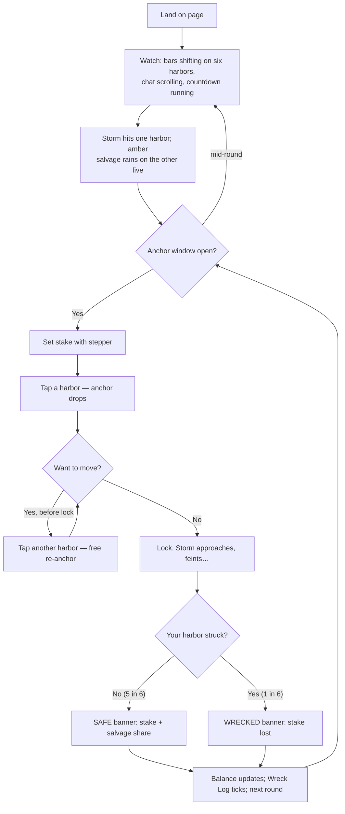

# Wireframes and User Flow — LANDFALL

**Prepared by:** UI/UX Team, with input from Lead Game Designer
**Phase:** 8 (rerun) — Wireframes
**Depends on:** [game-design-document.md](../02-game-design/game-design-document.md),
[technical-specification.md](../06-spec/technical-specification.md)

Layouts are structured ASCII + mermaid (no visual design tool in this phase); pixel-level design
is a later Art-Team pass using only free assets. Dark mode is the default; beacon amber is
reserved exclusively for payout moments (brand rule,
[game-design-document.md](../02-game-design/game-design-document.md)§0.3).

**v2 UX note:** these wireframes describe the runnable v1 MVP with exact live pool bars. The
category redesign replaces that strategic surface with Public Tide Reports, Blind Fog Lock,
Final Orders, Signal Flags, and post-round Wreck Wake Replay. See
[category-redesign-v2.md](../02-game-design/category-redesign-v2.md) for the target UX
requirements before redesigning this screen.

---

## 1. Main Game Screen (Desktop, Landscape) — Anchor Window

```
┌────────────────────────────────────────────────────────────────────────────┐
│ [⛯ LANDFALL]        Round #4821 · anchors lock in 0:07   [1,240 cr] [☰]    │
├──────────────────────────────────────────────────┬─────────────────────────┤
│                PIXI CANVAS (harbor map)          │  HARBOR CHAT (core)     │
│                                                   │ ┌─────────────────────┐ │
│   ┌────────┐   ┌────────┐   ┌────────┐          │ │ P_07: h3 is packed  │ │
│   │Harbor 1│   │Harbor 2│   │Harbor 3│          │ │ P_42: moving to 5   │ │
│   │████ 210│   │██ 90   │   │█████260│          │ │ SYSTEM: P_19 salv-  │ │
│   │ 4 boats│   │ 2 boats│   │ 6 boats│          │ │  aged +18.40 (H2)   │ │
│   └────────┘   └────────┘   └────────┘          │ │ You: gl everyone    │ │
│   ┌────────┐   ┌────────┐   ┌────────┐          │ └─────────────────────┘ │
│   │Harbor 4│   │Harbor 5│   │Harbor 6│          │ [ Type a message… ] [➤] │
│   │█ 50    │   │██ 95   │   │███ 145 │          ├─────────────────────────┤
│   │ 1 boat │   │ 3 boats│   │ 2 boats│          │ IN THE HARBOR  (18)     │
│   └────────┘   └────────┘   └────────┘          │  H1: P_03 50, P_11 80…  │
│        ⚓ = your anchor (Harbor 5)                │  H3: P_42 40, You 25…   │
├──────────────────────────────────────────────────┴─────────────────────────┤
│ WRECK LOG:  H3  H1  H6  H1  H4  H2  H2  H5 …          [🛡 Verify a round]  │
├──────────────────────────────────────────────────────────────────────────────┤
│  Stake: [ − ]  25.00  [ + ]      ┌──────────────────────────────────────┐   │
│  (adjustable until lock)         │  ⚓ DROP ANCHOR  →  tap any harbor    │   │
│                                  └──────────────────────────────────────┘   │
└──────────────────────────────────────────────────────────────────────────────┘
```

HUD inventory and placement rationale:

- **Harbor map canvas (center, largest):** the six harbors with **live pool bars and boat
  counts** are simultaneously the game board, the strategic information display, and the
  spectator drama — one surface does all three jobs. Tapping a harbor drops (or moves) your
  anchor; your current harbor shows the ⚓ badge. During the final 3 seconds the bars animate
  every re-anchor — the signature scramble is deliberately the most visually active moment.
- **Harbor Chat (right rail, always visible on desktop):** core feature, not a tab — Landfall's
  chat is strategically load-bearing ("h3 is packed"), so it never hides behind a switcher on
  wide screens. Salvage results arrive as unspoofable system messages *inside* chat (single
  social surface — [game-design-document.md](../02-game-design/game-design-document.md)§5.3).
- **In the Harbor (below chat):** per-harbor player stacks with stakes — the readable version of
  what the bars summarize.
- **Wreck Log (strip):** last ~20 struck harbors as icons; adjacent **"Verify a round"** button
  makes fairness tooling one tap away, not buried (differentiation carried over from the
  original product direction).
- **Stake + action bar (bottom):** stepper plus one instruction. There is no separate
  "confirm" — tapping a harbor IS the action (one-decision purity); re-tapping another harbor
  re-anchors.

### 1.1 Storm Approach & Landfall states (same layout, canvas takes over)

Storm approach (~4-5s): controls gray out ("anchors locked"), the storm sweeps the map,
visibly feinting toward 2-3 harbors (scripted from the committed seed —
[rng-provably-fair-spec.md](../04-architecture/rng-provably-fair-spec.md)§5). Landfall (~3s):
struck harbor takes the hit (desaturate + wreck FX); every surviving harbor rains beacon-amber
salvage numbers; your own result is a large banner ("SAFE +2.38" / "WRECKED −25.00"). Cooldown:
Wreck Log ticks, next round header appears, anchor window reopens.

## 2. Mobile / Portrait Layout

```
┌───────────────────────────┐
│ ⛯ 0:07  [1,240] [💬3] [☰] │  ← chat opens full-screen drawer (badge = unread)
├───────────────────────────┤
│   ┌──────┐    ┌──────┐    │
│   │ H1   │    │ H2   │    │
│   │██ 210│    │█ 90  │    │
│   ├──────┤    ├──────┤    │
│   │ H3   │    │ H4   │    │
│   │███260│    │▌50   │    │
│   ├──────┤    ├──────┤    │
│   │ H5 ⚓ │    │ H6   │    │
│   │█ 95  │    │██ 145│    │
│   └──────┘    └──────┘    │
├───────────────────────────┤
│ Wrecks: 3 1 6 1 4 2 …     │
├───────────────────────────┤
│ Stake [−] 25.00 [+]       │
│  tap a harbor to anchor   │
└───────────────────────────┘
```

- 2×3 harbor grid fills the width; each harbor is a ≥44px touch target by construction (the
  zones ARE the buttons — Landfall is naturally more touch-native than Crash's timing button).
- Chat is one tap away behind the badged icon (full-screen drawer with input + scrollback);
  "In the Harbor" collapses into tapping any harbor to see its occupant list.
- Breakpoints unchanged: <640px this layout; 640-1024px condensed two-column; >1024px full §1.
- High-refresh displays: storm/bar animations time-based, not frame-based (unchanged rule).

## 3. Settings Modal

```
┌─────────────────────────────────────────┐
│  Settings                          [X]   │
├─────────────────────────────────────────┤
│  Display name: [ SaltyJib          ]     │
│  Theme:        (•) Dark  ( ) Light       │
│  Sound:        [====------] 40%          │
│  Chat:         [ Show Harbor Chat  ▣ ]   │
│                [ Muted players: manage ] │
│  Fairness:     [ Verify a Past Round ]   │
│                [ View chain commitment ] │
└─────────────────────────────────────────┘
```

(The Crash-era client-seed field is gone — the hash-chain scheme has no per-player seed; in its
place, "View chain commitment" shows the season's public commitment `s_0` and chain position,
per [rng-provably-fair-spec.md](../04-architecture/rng-provably-fair-spec.md)§1.1.)

## 4. Verification Modal (one tap from the Wreck Log)

```
┌────────────────────────────────────────────────────┐
│  Verify Round #4821                          [X]    │
├────────────────────────────────────────────────────┤
│  Revealed seed s_i:        3a33cbdc…2905dadf        │
│  Prior chain value s_i-1:  eaa8e706…ae7e7058        │
│  ✓ SHA-256(s_i) matches the chain                   │
│  ✓ HMAC → u = 0.2478… → struck = Harbor 2           │
│    (matches the announced landfall)                 │
│  ✓ Storm feints (H3, H5) match the digest bytes     │
│  ── Your payout ─────────────────────────────       │
│  Lock snapshot: H1 130 · H2 90 · H3 250 · H4 50 ·   │
│                 H5 65 · H6 215   (total 800)        │
│  Your stake: 20 on H3                                │
│  ✓ 20 + 0.94×90×(20/710) = 22.38 — matches payment  │
├────────────────────────────────────────────────────┤
│  All checks passed: this round's outcome was fixed  │
│  before anchoring opened, the strike was uniform,   │
│  and your payout follows from the public snapshot.  │
└────────────────────────────────────────────────────┘
```

Note the two-part verification unique to Landfall: cryptographic (the draw) **and arithmetic
(your exact payout from the public lock snapshot)** — fairness of the split is checkable, not
just fairness of the strike ([rng-provably-fair-spec.md](../04-architecture/rng-provably-fair-spec.md)§4).

## 5. User Flow: First-Time Visitor → First Anchor → First Salvage



## 6. User Flow: Skeptic → Verification

```mermaid
flowchart TD
    A[Player suspects 'the storm chases the money'] --> B[Taps Verify on the round in the Wreck Log]
    B --> C[Modal recomputes chain link, draw, and their payout]
    C --> D{All checks pass?}
    D -- Yes --> E[Plain-language confirmation:\nstrike fixed before anchoring, uniform odds,\npayout follows from public snapshot]
    D -- No --> F[Prominent failure state + guidance\n(would indicate a real integrity breach)]
```

## 7. Theming

Dark default (navy/storm palette); light mode secondary; Tailwind dark-mode class strategy with
shadcn/ui tokens. **Beacon amber appears only for payouts** — the strongest single visual-brand
rule, enforced as a design token usable by exactly one semantic role.
